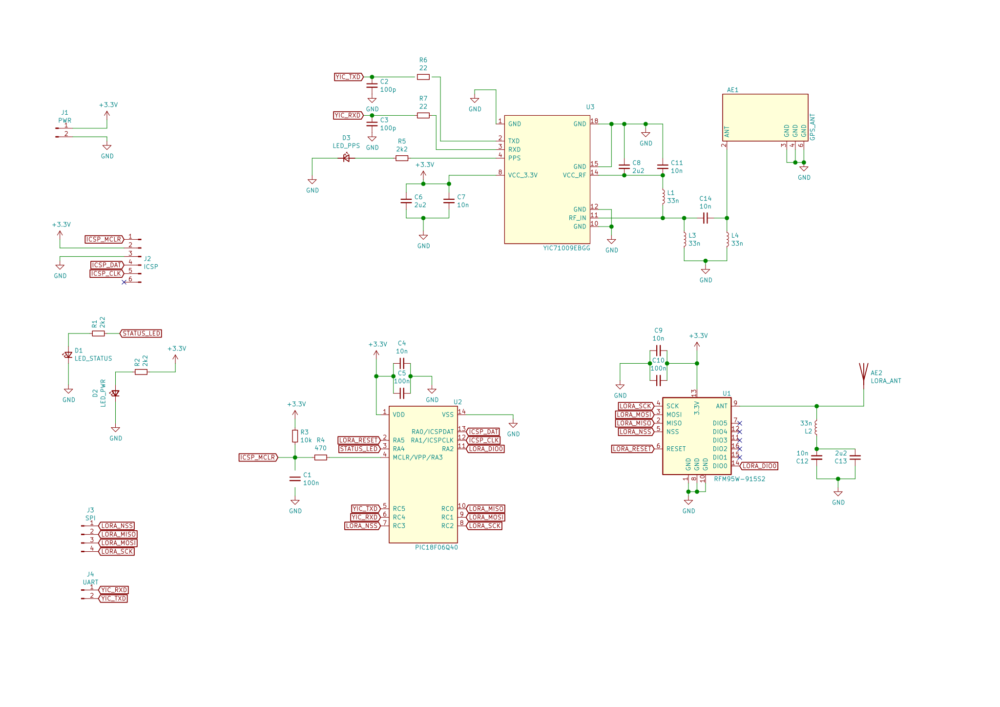
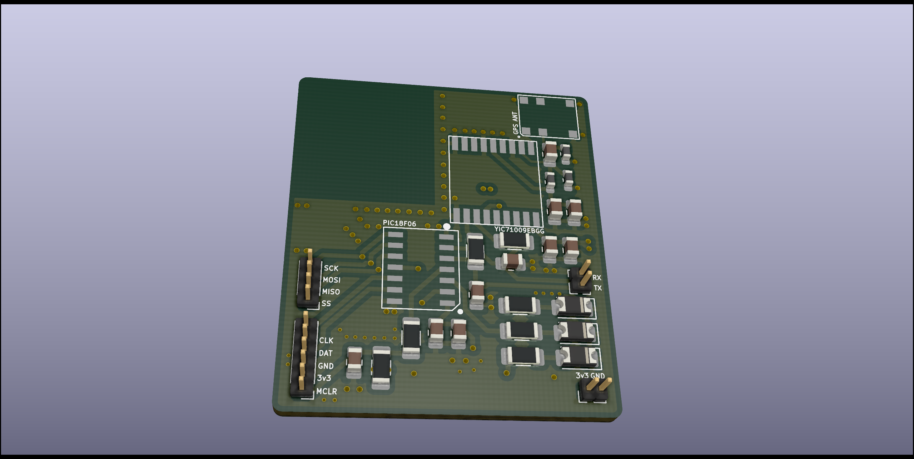

# ats

## Remote
- 3.3v power and ground header
    - No OVP
    - No OCP
    - No polarity protection
    - Modules have their own decoupling caps
    - Modules have decoupling capacitors
- SPI header for LoRa module debug
- UART header for GPS module debug
- ICSP header for programming the PIC18
- LoRa module and SMD antenna
- GPS module and SMD antenna
- PIC18 controller
    - Controls SPI and UART

  

  

## References
Microcontroller PIC18F06Q40 [datasheet](https://ww1.microchip.com/downloads/aemDocuments/documents/MCU08/ProductDocuments/DataSheets/PIC18F06-16Q40-Data-Sheet-40002216D.pdf)  
LoRa Tranceiver RFM95W [datasheet](https://www.rfsolutions.co.uk/downloads/1463993415RFM95_96_97_98W.pdf)  
GPS/GLONASS Receiver YIC71009EBGG [datasheet](https://www.yic.com.tw/wp-content/uploads/2021/05/YIC71009EBGG.pdf)   
